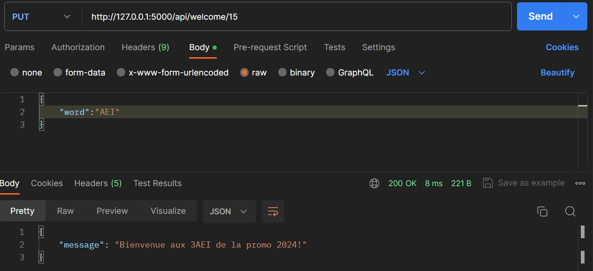
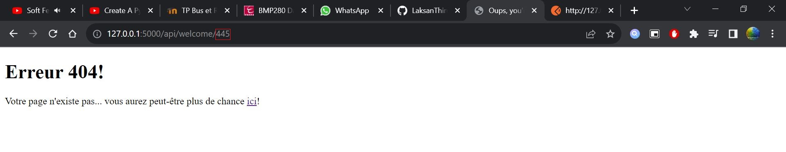

# 2324_ESE_3727_DU_THIRUKUMARAN

# Présentation 

L'objectif final du TP consiste à employer différents bus de communication et de mettre en place tous les composants suivants : <br>


Ce TP se compose en 5 parties:<br>
**1. Interrogation des capteurs par le bus I²C**<br>
**2. Interfaçage STM32 <-> Raspberry Pi**<br>
**3. Interface Web sur Raspberry Pi**<br>
**4. Interface API Rest & pilotage d'actionneur par bus CAN**<br>
**5. Intégration I²C - Serial - REST - CAN** <br>

# 1.  BUS I²C 
L'objectif de cette partie est d'interfacer une carte STM32 avec des capteurs I²C. <br>


## BMP280
Premièrement, nous réalisons la mise en oeuvre du BMP280. Le BMP280 est un capteur de température et de pression développé par Bosh. Ce capteur utilise l'I²C comme protocole de communication. Nous prenons connaissance des principaux registres de ce capteur pour y récupérer adresse et valeur, par exemple, les adresses I²C possibles du capteur, l'identification du capteur, pour ensuite configurer le capteur afin de récupérer certaines valeurs. <br> 
Voici les différents registres : <br>


## Communication I²C
Les adresses I²C possibles pour réaliser une communication avec le capteur sont :<br>
En écriture : ```(0x77<<1)``` <br>
En lecture :  ```(0x77<<1) | 0x01``` <br>
Le registre qui permet d'identifier le composant est le ```0xD0``` et la valeur est ```0x58```. <br>
Pour tester l'identification du composant, nous utilisons la fonction ```devID_BMP()```. Nous utilisons les fonctions ```HAL_I2C_Master_Transmit()``` et ```HAL_I2C_Master_Transmit() ``` pour lire un registre et récupérer sa valeur. <br>

```c
void devID_BMP(void)
{
	printf("Debut de l'ID\r\n");
	HAL_I2C_Master_Transmit(&hi2c1, BMPAddress << 1,&dev_ID, 1, HAL_MAX_DELAY);
	HAL_I2C_Master_Receive(&hi2c1, (BMPAddress << 1)|0x01, dataBuffer, sizeof(dataBuffer), HAL_MAX_DELAY);
	printf("%s",dataBuffer);
	printf("Fin ID\r\n");
}
void setConfig_BMP(void)
{
	printf("Debut de la config\r\n");
	HAL_I2C_Master_Transmit(&hi2c1, BMPAddress << 1,TabConfig, 2, HAL_MAX_DELAY);
	HAL_I2C_Master_Receive(&hi2c1, (BMPAddress << 1) | 0x01, Sendback, sizeof(Sendback), HAL_MAX_DELAY);
	uint8_t newvalue= Sendback[0];
	printf("%02X\r\n",newvalue);
  /* La varibales SendBack contient la valeur du registre d'indentification 0xD0 */

}
```

Pour modifier le fonctionnement du composant, il faut modifier le registre ```0xF4```. Les registres contenant la température sont : ```0xFA``` à ```0xFC``` et ```0xF7``` à ```0xF9``` pour ceux de la pression. La température et la pression sont répresentés sur 5 octets ( 8 bits MSB, 8 bits LSB, 4 bits xLSB). Nous utilisons les fonctions ```temperatureNonCompense()``` et ```pressionNonCompense()``` pour récupérer les valeurs des registres de température et de pression puis, nous affichons les valeurs non compensés de la pression et de la température. <br>
```c
uint32_t temperatureNonCompense(void){
	HAL_I2C_Master_Transmit(&hi2c1, BMPAddress << 1,&TMsbAdress, 1, HAL_MAX_DELAY);
	HAL_I2C_Master_Receive(&hi2c1, (BMPAddress << 1) | 0x01, T_Msb, sizeof(T_Msb), HAL_MAX_DELAY);
	uint8_t MSB= T_Msb[0];

	HAL_I2C_Master_Transmit(&hi2c1, BMPAddress << 1,&TLsbAdress, 1, HAL_MAX_DELAY);
	HAL_I2C_Master_Receive(&hi2c1, (BMPAddress << 1) | 0x01, T_Lsb, sizeof(T_Lsb), HAL_MAX_DELAY);
	uint8_t LSB= T_Lsb[0];

	HAL_I2C_Master_Transmit(&hi2c1, BMPAddress << 1,&TxLsbAdress, 1, HAL_MAX_DELAY);
	HAL_I2C_Master_Receive(&hi2c1, (BMPAddress << 1) | 0x01, T_xLsb, sizeof(T_xLsb), HAL_MAX_DELAY);
	uint8_t xLSB= T_xLsb[0];

	TempValue |= ((uint32_t)MSB << 12);
	TempValue |= ((uint32_t)LSB << 4);
	TempValue |= (xLSB & 0x0F);

	printf("La temprature non compense est de : %lX\r\n", TempValue);
	printf("\n");
	return TempValue;
}
uint32_t pressionNonCompense(void){
	HAL_I2C_Master_Transmit(&hi2c1, BMPAddress << 1,&PMsbAdress, 1, HAL_MAX_DELAY);
	HAL_I2C_Master_Receive(&hi2c1, (BMPAddress << 1) | 0x01, P_Msb, sizeof(P_Msb), HAL_MAX_DELAY);
	uint8_t PMSB= P_Msb[0];

	HAL_I2C_Master_Transmit(&hi2c1, BMPAddress << 1,&PLsbAdress, 1, HAL_MAX_DELAY);
	HAL_I2C_Master_Receive(&hi2c1, (BMPAddress << 1) | 0x01, P_Lsb, sizeof(P_Lsb), HAL_MAX_DELAY);
	uint8_t PLSB= P_Lsb[0];

	HAL_I2C_Master_Transmit(&hi2c1, BMPAddress << 1,&PxLsbAdress, 1, HAL_MAX_DELAY);
	HAL_I2C_Master_Receive(&hi2c1, (BMPAddress << 1) | 0x01, P_xLsb, sizeof(P_xLsb), HAL_MAX_DELAY);
	uint8_t PxLSB= P_xLsb[0];

	PressValue |= ((uint32_t)PMSB << 12);
	PressValue |= ((uint32_t)PLSB << 4);
	PressValue |= (PxLSB & 0x0F);

	printf("La pression non compense  est de : %lX\r\n", PressValue);
	printf("\n");
	return PressValue;

}
/* Nous récupérons les valeurs (MSB, LSB, xLSB) puis nous effectuons un décallage pour récupérer la valeur sur 5 octets */
```
Nous avons utilisé les fonctions de compensation indiquées dans la datasheet du composant. Ses fonctions permettent d'avoir un entier sur 32 bits. Nous avons d'abord récuperé les dig_Tx et digPx afin d'appliquer les fonctions de compensation. ```c bmp280_compensate_T_int32()``` et ```bmp280_compensate_P_int32()``` <br>

**Pour conclure, nous arrivons à récupérer les valeurs non compensées mais lorsque nous utilisons les fonctions de compensations, nous avons des valuers qui ne sont pas cohérentes. Toutes les fonctions et les variables utilisés se trouvent le fichier "BMP.c"** <br>

# 2. Interfaçage STM32 - Raspberry
L'objectif est de permettre l'interrogation du STM32 via un Raspberry Pi Zero ```(RP0)``` Wifi
## Mise en route du RP0
Nous "flashons" la carte SD à l'aider de rpi-imager.
Nous nous configurons sur le réseau spécifique
```
SSID : ESE_Bus_Network
Password : ilovelinux
```
Nous installons la carte SD dans notre RP0 puis nous nous y connectons par SSH à l'aide de l'adresse IP du RP0

## Communication avec la STM32
Dans cette partie, nous voulons réaliser un protocole de communication entre la Raspberry et la STM32 : 


Nous utilisons l'uart3 pour la communication entre la Raspberry et la STM32. Sur la partie STM32, nous comparons le caractère reçu par l'uart3 aux différents protocoles. Pour cela, nous activons l'interruption pour l'uart3 et nous utilisons un callback pour comparer le caractère reçu : 
```c
void HAL_UART_RxCpltCallback(UART_HandleTypeDef *huart)
{
	if (huart == &huart3)
	{
		printf("%s",rxPiBuffer);
		if (strcmp(rxPiBuffer, "GET_T") == 0) {
			noneCompensatedTemperature=temperatureNonCompense();
			compensatedTemperature=bmp280_compensate_T_int32(noneCompensatedTemperature)
			  printf("La valeur de la temperature compense = %d C\n\r",(int)(compensatedTemperature));
		}
		else if (strcmp(rxPiBuffer, "GET_P") == 0) {

			nonecompensatedPression = pressionNonCompense();
			compensatedPression=bmp280_compensate_T_int32(nonecompensatedPression);
			  printf("La valeur de la pression compense = %d C\n\r",(int)(compensatedPression));
		}
		else if (strcmp(rxPiBuffer, "GET_K") == 0) {
			printf("K=%d.%d000\r\n",(int)(K/100),K%100);
				}
		else if (strcmp(rxPiBuffer, "GET_A") == 0) {
			printf("A=%d.%d000\r\n",(int)(A/1000),A%1000);

				}
		else if (strcmp(rxPiBuffer, "SET_K") == 0) {

				}
		else {
			printf("Command no exist \r\n");

		}
	}
	HAL_UART_Receive_IT(&huart3, rxPiBuffer, 1);
}
```
## Commande depuis Python
Après avoir établi le protocole de communication entre minicom et la STM32, passons maintenantn sur python : ```BMP280.py```

# 3. Interface REST
L'objectif est le développement d'une interface REST sur le Raspberry
## Premier fichier web et première route
Pour cela, nous utilisons ```Flask```, un framework open-source de développement web en Python.
```
welcome = "Welcome to 3ESE API!"

@app.route('/api/welcome/')
def api_welcome():
    return welcome
    
@app.route('/api/welcome/<int:index>')
def api_welcome_index(index):
    return welcome[index]
```
## Première page REST
Pour qu'il s'agisse d'une interface REST, nous serons amenés à utiliser JSON et les requêtes HTTP
### API CRUD
En reprenant la fonction ```api_welcome_index```, créons les CRUD suivants : 

#### Tests des API sur la plateforme POSTMAN





### Erreur 404
Redirection sur la page 'erreur' si ```@app.route('/')``` ou si ```index < taille(welcome)```, placez-vous dans ```@app.route('/api/welcome/')```




# 4. Bus CAN 
Nous n'avons pas traité la partie CAN. <br>

# Auteurs : 
**Clément DU** <br>
**Laksan THIRUKUMARAN**
